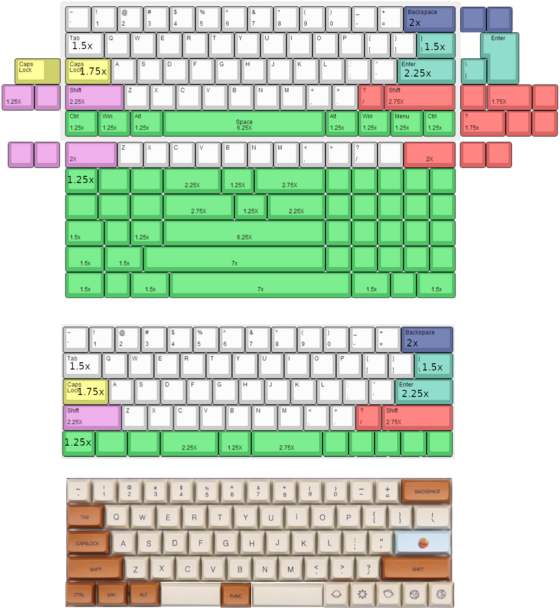

# KBDKID

## Info
Rebind caps lock to something useful, maybe mouse layer?\
Find out how to make it wireless?

### Bottom row from left to right
| 1.25x | 1.25x | 1.25x | 2.25x | 1.25x | 2.75x | 1x | 1x | 1x | 1x | 1x |
| --- | --- | --- | --- | --- | --- | --- | --- | --- | --- | --- |
| lctrl | lsuper | lmeta | space | hyper | lower | upper | rmeta | rsuper | menu | rctrl |

### Number of keycaps required
| Size[U] | Amount | Keys |
| ---     | --- | --- |
| 1x      | 51 | norms, rmeta, rsuper, menu, rctrl |
| 1.25x   | 4  | lctrl, lsuper, lmeta, hyper |
| 1.5x    | 2  | tab, backslash |
| 1.75x   | 1  | caps lock |
| 2x      | 1  | backspace |
| 2.25x   | 3  | enter, lshift, space |
| 2.75x   | 2  | rshift, lower |

Total number of keys: 64

## BOM
### Case
* 60% WOOD CASE FOR DZ60 GH60 https://kbdfans.com/products/60-keyboard-wood-case?variant=40492079629

### PCB
* DZ60 REV 3.0 60% MECHANICAL KEYBOARD PCB https://kbdfans.com/products/dz60-60-pcb?variant=28607000739888

### Plate
* DZ60 CNC (ALUMINUM/STEEL/BRASS) PLATE https://kbdfans.com/collections/plate/products/dz60-cnc-aluminum-plate?variant=2208864436237

### Switch
* ZealPC Zilent 62g
* Cherry MX Red Silent 45g https://kbdfans.com/products/cherry-mx-silent-red?variant=20541726916666

### Stabs
* PCB stabilizers black color https://kbdfans.com/collections/keyboard-stabilizer/products/pcb-stabilizers-black-color?variant=35974658637

### Keycaps
* PBT KT1 Profile Keycaps https://kbdfans.com/collections/keycaps/products/pbt-kt1-profile-keycaps-1

### Accessories
* Lube
* F1.8mm LED 70PCS White https://kbdfans.com/collections/keyboard-part/products/f1-8mm-led-100pcs?variant=40117533581
* USB-C TYPEC USB CABLE https://kbdfans.com/collections/usb-cable/products/usb-c-typec-usb-cable
